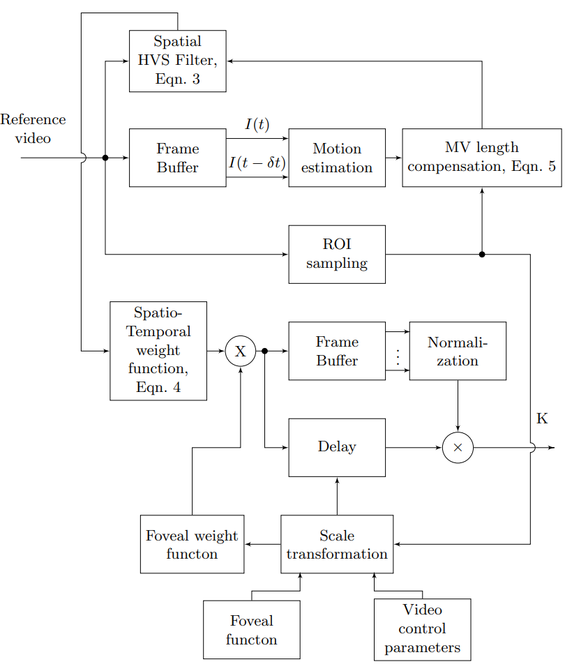

# PSNR-M-Plus
Full Reference video quality assessment algorithm considering the features of the human visual system.

 We propose a PSNR-based video quality assessment method that also incorporates measurements of the HVS, which we call PSNR-M+. The HVS factors included are spatial and temporal frequency, eccentricity (distance from the centre of the fovea in visual degrees), luminance, adaptation aspects of the HVS, and stimulus size. This new metric is an extension of our earlier PSNR-M, which considered a small dataset on the dependence of separate spatial and temporal HVS characteristics on luminance, which was proven effective in comparison to PSNR.

A flow diagram framework of the methodology for calculating weight coefficients is shown in the figure below.

The figure below shows the correlation interval of video quality metrics on video sequences LIVE-NFLX. The new proposed metric, PSNR-M+, has the most consistent high correlation of the metrics tested herein.

# Contact information

If you would like more information, feel free to email your request to vladimir.a.mazin@gmail.com.
